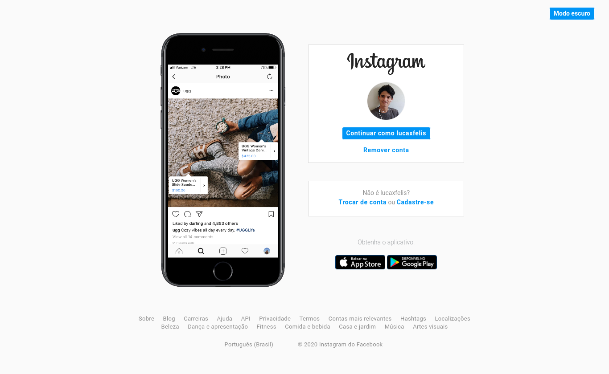
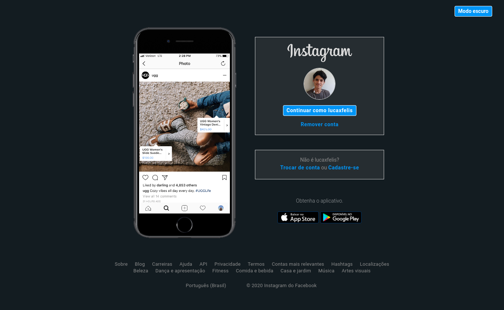

# Recriando a página inicial do Instagram

Atividade referente ao Bootcamp Decola Dev Avanade 2021 em conjunto com a Digital Innovation One :rocket:, que propõe uma recriação aproximada da página inicial do Instagram abordando CSS Flexbox e responsividade. Esse projeto é baseado no vídeo tutorial da professora Gabriela Pinheiro, disponibilizado na plataforma da Digital Innovation One e chamado "Recriando a página inicial do Instagram".

Você pode conferir a página [aqui](https://lucaxfelis.github.io/pagina-inicial-instagram/).

## Implementações extras

Além dos requisitos demonstrados no vídeo tutorial, também foram implementados, um menu de navegação e um rodapé inspirados também na versão original da página inicial do Instagram, além do favicon presente na barra de título. Foi também adicionado um botão que ao ser acionado, alterna o tema da página entre claro e escuro. Para a mudança dos temas, é utilizado um script em JavaScript que altera as classes de estilo dos elementos HTML.

## Tecnologias utilizadas

* HTML
* CSS
* JavaScript

## Screenshots dos layouts
Tema claro e tamanho normal:

Tema claro e tamanho mobile:

Tema escuro e tamanho normal:

Tema escuro e tamanho mobile:

